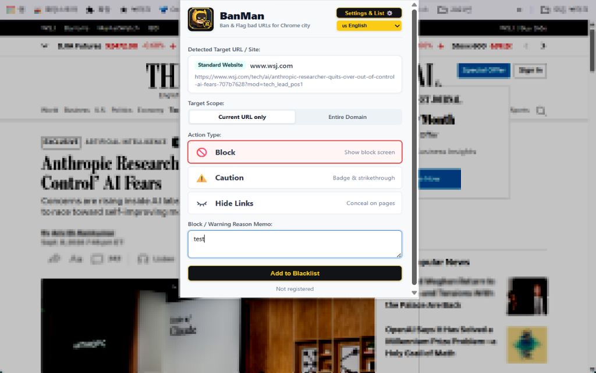
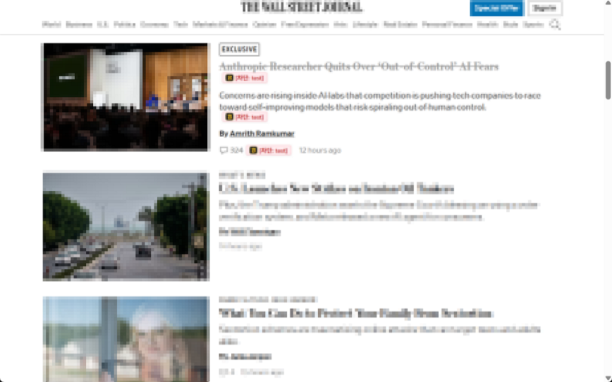
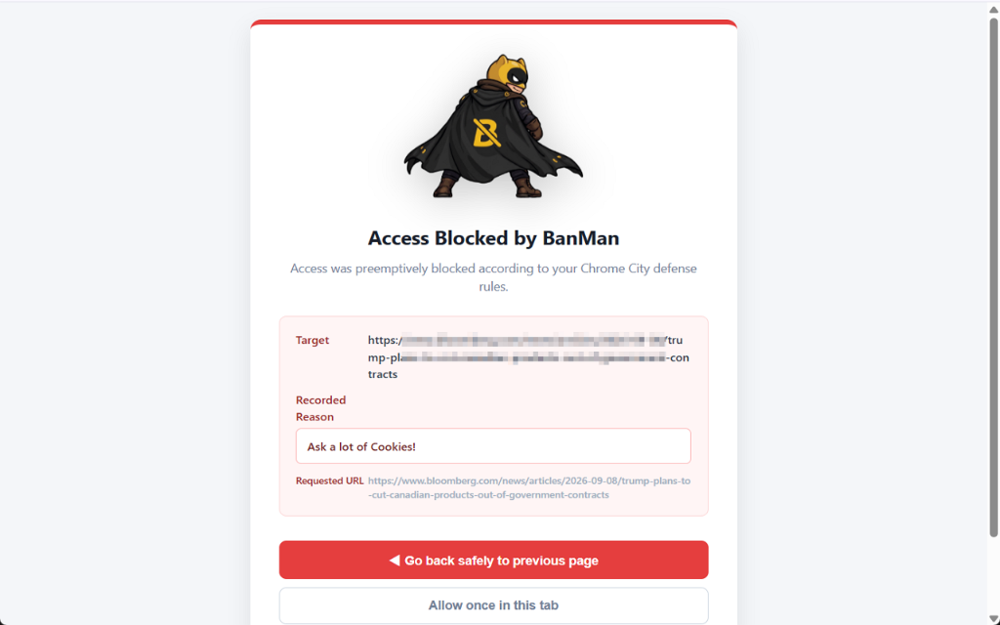

<p align="center">
  
</p>

<h1 align="center">BanMan: Ban & Flag Bad URLs</h1>

<p align="center">
  <strong>Smart Browsing Guard</strong> — 광고 폭탄, 쿠키 강요 사이트 차단 & 쇼핑몰 지뢰 제품/링크에 깃발을 꽂아주는 스마트 브라우징 도구
</p>

<p align="center">
  
  
  
  <a href="https://github.com/jystorian/BanMan/releases/tag/v1.0.0"></a>
</p>

---

BanMan은 복잡한 백신 프로그램이 아닙니다.  
웹 서핑 중 직접 겪어보고 불쾌했던 사이트(광고 폭탄, 과도한 쿠키 요구)나, 쇼핑몰·앱스토어에서 써보고 실망했던 '지뢰 제품/링크'를 내가 직접 블랙리스트로 등록하고 관리하는 나만의 스마트 브라우징 도구입니다.

내가 한 번 거른 사이트나 상품은 다음번에 검색 결과나 웹서핑 중 마주쳐도 눈에 띄는 '경고 깃발(Flag)'이 꽂히거나 아예 숨겨지므로, 귀중한 시간 낭비와 불필요한 재방문·재구매 실수를 완벽하게 방지해 줍니다.

---

## 📸 주요 화면 (Screenshots)

| 1. 간편한 블랙리스트 등록 (Popup UI) | 2. 웹페이지/검색 결과 링크 경고 (Flag) |
| :---: | :---: |
|  |  |
| **방문 중인 페이지나 불량 상품을 1클릭 등록** | **등록된 배드 링크 옆에 즉각 시각적 경고 깃발 표시** |

<br>

<div align="center">
  <h3>3. 원치 않는 사이트 사전 차단 (Block Screen)</h3>
  
  <p><em>광고 폭탄이나 과도한 쿠키 사이트 방문 시 즉시 진입을 사전 차단하고 안전한 복귀/임시 허용 옵션 제공</em></p>
</div>

---

## ✨ 주요 기능 (Key Features)

- **🚫 광고 폭탄 / 쿠키 강요 페이지 사전 차단 (Ban)**: 접속 시 불쾌한 광고나 쿠키를 강요하는 사이트의 재진입을 사전에 완벽 차단
- **🚩 쇼핑몰 '지뢰 제품' & 저품질 링크 경고 (Flag)**: 쇼핑몰, 앱스토어, 검색 결과에서 써보고 실망했던 링크 옆에 선명한 경고 깃발 표시
- **👁️ 눈앞에서 지우는 링크 숨김 (Hide)**: 경고 깃발뿐 아니라 불쾌한 링크를 화면에서 아예 감추는 숨김 모드 지원
- **🎯 핀포인트 상세 URL 타겟팅**: 도메인 전체는 물론 특정 게시글, 특정 상품 상세 페이지만 핀포인트로 지정 가능
- **⚡ 초고속 매칭 엔진**: 도메인 계층 역색인 기반 $O(1)$ 알고리즘으로 10,000개 이상의 규칙이 쌓여도 브라우징 속도(0.002ms) 저하 제로
- **☁️ Google Drive 클라우드 스마트 동기화**: 새 PC나 노트북에서도 클릭 한 번으로 나만의 소중한 블랙리스트를 스마트 병합 동기화
- **🔐 클라이언트 종단간 암호화 (E2EE)**: Web Crypto API(AES-256-GCM + PBKDF2)로 구글조차 내 규칙 목록을 볼 수 없도록 마스터 비밀번호로 암호화
- **🌐 3개국어 완벽 지원**: 한국어(KO), 영어(EN), 일본어(JA) UI 완벽 지원

---

## 📦 설치 방법 (Installation)

1. 저장소를 클론하거나 ZIP 파일로 다운로드합니다:
   ```bash
   git clone https://github.com/jystorian/BanMan.git
   ```
2. 크롬 브라우저를 열고 주소창에 `chrome://extensions` 를 입력합니다.
3. 우측 상단의 **개발자 모드(Developer mode)** 스위치를 켭니다.
4. 좌측 상단의 **[압축해제된 확장 프로그램을 로드합니다]** 버튼을 클릭하고 `BanMan` 폴더를 선택합니다.

---

## 🔒 개인정보 보호 (Privacy)

BanMan은 사용자의 개인정보를 소중히 여깁니다. 별도의 외부 수집 서버를 일체 두지 않으며, 구글 드라이브 동기화 시에도 격리된 전용 공간(`appDataFolder`)만을 사용합니다. 자세한 내용은 [PRIVACY.md](PRIVACY.md)를 참조하세요.

---

## 📄 라이선스 (License)

This project is licensed under the MIT License - see the [LICENSE](LICENSE) file for details.
