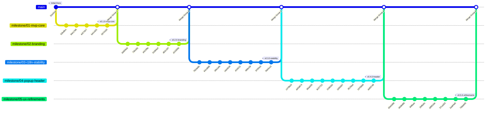

# 🛡️ BanMan Git 히스토리 & 마일스톤 가이드

본 문서는 **BanMan (Chrome City Blacklist Protector)** 프로젝트의 전체 커밋 기록을 5대 핵심 마일스톤 그룹으로 체계화하여 보관하는 공식 가이드입니다.

---

## 🗺️ 전체 마일스톤 Git 그래프 구조



---

## 📌 5대 마일스톤 그룹별 커밋 상세 내역

### 1️⃣ 그룹 1: MVP 코어 엔진 구축 (`v0.1.0-mvp-core`)
> 크롬 익스텐션(Manifest V3) 아키텍처 수립 및 3대 핵심 컴포넌트(백그라운드, 콘텐츠 스크립트, 팝업/옵션) 완성

| 커밋 SHA | 구분 | 주요 작업 내용 | 관련 컴포넌트 |
|---|---|---|---|
| `32e3411` | docs | 초기 참조 문서 보관 (웹스토어 감지 Service Worker 및 템퍼몽키 스크립트) | `docs/references/` |
| `62bd8cc` | feat | Manifest V3 메타데이터 및 다중 해상도 아이콘 에셋 추가 | `manifest.json`, `icons/` |
| `84e1798` | feat | Background Service Worker 구현 (웹스토어 감지 및 사전 차단) | `background.js` |
| `ed17dc7` | feat | Content Script 구현 (링크 감지, 숨김/취소선/메모 배지 및 동적 감시) | `content.js` |
| `ba1cd31` | feat | Popup UI 구현 (현재 탭 자동 감지 및 원클릭 등록) | `popup/popup.*` |
| `0574150` | feat | 차단 안내 화면 및 옵션 대시보드 구현 (JSON 백업/복원 포함) | `pages/blocked.*`, `pages/options.*` |

---

### 2️⃣ 그룹 2: 공식 브랜딩 & 캐릭터 아이덴티티 확립 (`v0.2.0-branding`)
> 'BanMan: Ban & Flag' 공식 세계관 수립, 16비트 도트 캐릭터 시트 추출 및 스큐어모피즘 가죽 카울 엠블럼 구축

| 커밋 SHA | 구분 | 주요 작업 내용 | 관련 컴포넌트 |
|---|---|---|---|
| `bb559a2` | style | 확장 프로그램 명칭을 'Ban and Flag'로 1차 리브랜딩 | `manifest.json` |
| `730cfd1` | feat | 'BanMan: Ban & Flag Bad URLs for Chrome City' 공식 브랜딩 반영 | `manifest.json`, UI 전체 |
| `d412f8a` | feat | 반맨(BanMan) 16비트 도트 캐릭터 에셋 추출 및 UI/아이콘 전면 연동 | `resources/`, `icons/` |
| `01994a7` | feat | 확정 반맨(BanMan) 캐릭터 시트 교체 및 금지-B 망토 스프라이트 연동 | `pages/blocked.*` |
| `db2c187` | style | 스큐어모피즘(03-skeuomorphic) 가죽 카울 밴맨 아이콘 적용 | `icons/` |
| `d14300b` | fix | 스큐어모픽 아이콘 외곽 배경 투명화(RGBA) 처리 | `icons/` |

---

### 3️⃣ 그룹 3: 다국어(i18n) 시스템 & 런타임 안정화 (`v0.3.0-i18n-stability`)
> 한/영/일 3개 국어 i18n 딕셔너리 구축, 비동기 탭 생명주기 에러 방어, 대시보드 인라인 편집 및 모달 도입

| 커밋 SHA | 구분 | 주요 작업 내용 | 관련 컴포넌트 |
|---|---|---|---|
| `782de8e` | feat | 픽셀 B로고 투명화, 기본 URL 타겟팅, 대시보드 버튼 직관화 및 한/영/일 다국어 지원 | `i18n.js`, UI 전체 |
| `641d996` | style | 타이틀 하단 여백 및 구분선 추가, 일본어 레이아웃 안정화 및 다국어 일관성 개선 | `popup/popup.css`, `i18n.js` |
| `d5b1efa` | fix | TDZ ReferenceError 방지를 위한 blacklist_rules 선언 위치 및 로드 시점 최적화 | `popup/popup.js` |
| `c6a3634` | feat | 차단 페이지 안전한 뒤로가기/1회임시허용 루프 방지 로직 개선 및 고해상도 엠블럼 교체 | `pages/blocked.js` |
| `ef16211` | feat | 관리 대시보드 규칙 수정 방식 개편 (브라우저 prompt 제거 -> 인라인 드롭다운/모달 지원) | `pages/options.*` |
| `4f68c59` | feat | 수정/삭제 버튼 가로 정렬 고정 및 원작 16비트 캐릭터/차량 정밀 투명 배경화 | `resources/`, `pages/options.*` |
| `870f4c5` | fix | 닫힌 탭(No tab with id) 관련 비동기 Chrome API 호출 예외 처리 강화 | `background.js` |
| `56e5cc3` | fix | 탭 닫힘 및 알림/배지 업데이트 시 console.error 발생 방지 | `background.js` |

---

### 4️⃣ 그룹 4: 웹스토어 연동 & 팝업 헤더 룩앤필 완성 (`v0.4.0-popup-header`)
> 서비스워커 기반 웹스토어 제목 자동 스크랩(CORS 해결), 헤더 48px 그리드 정렬 및 블랙/옐로우/레드 테마 디테일링

| 커밋 SHA | 구분 | 주요 작업 내용 | 관련 컴포넌트 |
|---|---|---|---|
| `c479b20` | feat | 팝업 헤더 슬로건 추가, 우측 버튼 2줄 정리 및 웹스토어 확장명 표시/링크 연동 | `popup/popup.*` |
| `a65d874` | feat | 얼굴+B마크 아이콘 교체, BanMan 폰트 강화, 설정버튼 노란테두리/검정배경 스타일 적용 | `popup/popup.*` |
| `88a02f0` | feat | 서비스워커 기반 웹스토어 제목 조회로 CORS 해결, ID 중복제거, 팝업 헤더 열맞춤 | `background.js`, `pages/options.*` |
| `8c57722` | feat | 설정버튼 옐로우/레드 액티브 글로우, 등록일 2줄 스택, 정방형 X 삭제버튼 적용 | `popup/popup.css`, `pages/options.css` |
| `018b2dc` | feat | 설정버튼 클릭 시 다크레드 글로우, 언어선택 노랑배경/검정글씨, 대시보드 등록일 폭 확대 | `popup/popup.css`, `pages/options.css` |
| `1b50d57` | feat | 설정버튼 100% 레드 호버 및 와이드 다크레드 확산, 언어선택버튼 컴팩트화 | `popup/popup.css` |
| `3f126ed` | feat | 크롬 툴바/확장탭은 B마크로 지정하고, 실행창/설정페이지는 얼굴+B 아이콘으로 분리 | `manifest.json`, UI |
| `1975899` | feat | 좌우 헤더 영역 높이를 정확히 48px로 1:1 일치시켜 상하 오버플로우 완전 제거 | `popup/popup.css` |
| `dd937d9` | feat | 설정버튼 호버 시 딥 다크오렌지, 클릭 시 차분한 갈색빛 레드 및 인셋 클릭 효과 적용 | `popup/popup.css` |

---

### 5️⃣ 그룹 5: 에셋 최적화 & 최종 UI/UX 정밀 리파인먼트 (`v0.5.0-ux-refinements`)
> 미사용 에셋 삭제 정리, 벡터 망토/클래식 밴 정착, 감은 눈 SVG 및 툴바 BAN/BAD 배지 개편, 버튼 문구 통일

| 커밋 SHA | 구분 | 주요 작업 내용 | 관련 컴포넌트 |
|---|---|---|---|
| `65e0d98` | feat | 유저 제공 B마크 아이콘으로 익스텐션 바/툴바 아이콘 교체 및 32px 해상도 추가 | `icons/`, `manifest.json` |
| `d5d9d88` | feat | banman-app-icons 폴더 제거 및 신규 차량/망토 캐릭터/설정시트 리소스 교체 | `resources/` |
| `94ffaee` | feat | 불필요한 구형 리소스 5종 삭제 및 content.js 표준 아이콘 참조 전환 | `resources/`, `content.js` |
| `2bf8a5c` | feat | 차단페이지 벡터 망토, 대시보드 클래식 밴 적용 및 실행창 등록버튼 블랙/옐로우 테마 적용 | `resources/`, `pages/blocked.css` |
| `d9951be` | feat | 대시보드 목록에서 일반 웹페이지(도메인/URL) 대상에도 새 탭 열기 링크(🔗) 제공 | `pages/options.*` |
| `57ca2b3` | feat | 설정 및 목록 버튼명 변경, 경고&메모를 주의로 변경, 링크숨김 감은 눈(closed eye) SVG 적용 | `i18n.js`, UI 전체 |
| `2aa84a6` | feat | 처리방식 아이콘 가로 정렬 일치, 문구 폰트 확대 및 설명 우측 배치, 차단(적색 BAN)/주의(주황 BAD) 배지 반영 | `popup/popup.*`, `background.js` |
| `78da845` | feat | 등록된 규칙 수정 버튼 문구를 '유형 및 메모 수정'으로 변경 (다국어 포함) | `i18n.js` |

---

## 🔍 터미널에서 그룹별 Git 로그 확인하는 방법

```bash
# 컬러 그래프와 태그 뱃지를 함께 확인
git log --graph --oneline --decorate --all

# 각 마일스톤 태그 목록 확인
git tag -n
```
